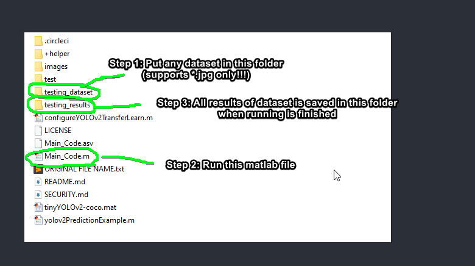

# YOLO v2 custom data object detection

- Download link 

## How to perform YOLOv2 analysation on the dataset:
### (Support .jpg only!!!)

## Code reference:

## What changes:
- Instead of using pretrained model in matlab files (like the  did), I have updated it so it can work on any dataset as long as it placed in the folder "testing_dataset" and the new result images will be saved inside "testing_results" folder
